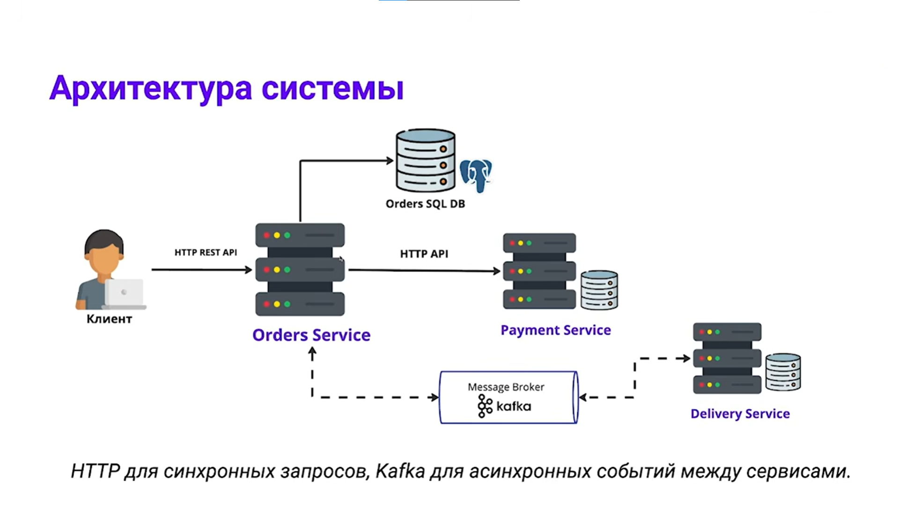

# 📦 Order Platform

**Order Platform** — демонстрационный проект, реализующий микросервисную архитектуру обработки заказов с использованием **Spring Boot**, **Apache Kafka** и **PostgreSQL**.

Проект демонстрирует взаимодействие нескольких независимых сервисов посредством синхронной (REST) и асинхронной (Kafka) коммуникации. Общие HTTP-контракты и события обмена вынесены в отдельный модуль `common-libs`, что позволяет сервисам использовать единые модели данных без дублирования кода.

---

## 🏗 Архитектура


Взаимодействие сервисов построено по принципу **REST + Event-Driven Architecture**:

* **Order Service** отвечает за жизненный цикл заказа;
* **Payment Service** обрабатывает платежи;
* **Delivery Service** назначает курьера после успешной оплаты;
* **Apache Kafka** используется для обмена бизнес-событиями между сервисами.

---

## 📁 Структура проекта

```text
order-platform
│
├── common-libs
├── order-service
├── payment-service
└── delivery-service
```

### 📚 common-libs

Общий модуль контрактов, используемый всеми микросервисами.

Содержит:

* HTTP DTO;
* Kafka Events;
* общие Enum.

---

### 🛒 order-service

Основной сервис платформы, отвечающий за управление заказами.

Функциональность:

* создание заказа;
* расчет стоимости;
* получение информации о заказе;
* обработка оплаты;
* публикация событий в Kafka;
* обработка событий назначения доставки.

---

### 💳 payment-service

Сервис обработки платежей.

Функциональность:

* создание платежа;
* хранение информации об оплате;
* определение результата оплаты;
* идемпотентная обработка повторных запросов.

---

### 🚚 delivery-service

Сервис назначения доставки.

Функциональность:

* получение события успешной оплаты;
* назначение курьера;
* расчет ETA (Estimated Time of Arrival);
* публикация события назначения доставки.

---

## ⚙️ Используемый стек

| Category        | Technologies |
|----------------|-------------|
| Programming Language | Java 21 |
| Backend Framework | Spring Boot 3 |
| REST Communication | Spring Web, Spring HTTP Interface (`@HttpExchange`), RestClient |
| Messaging | Apache Kafka |
| Database | PostgreSQL |
| ORM | Spring Data JPA (Hibernate) |
| Object Mapping | MapStruct |
| Build Tool | Gradle (Multi-module) |
| Containerization | Docker Compose |
| Utilities | Lombok |

---

## 🚀 Запуск проекта

### 1. Запустить инфраструктуру

В корне проекта выполнить:

```bash
docker compose up -d
```

Будут автоматически запущены:

* PostgreSQL
* Apache Kafka

---

### 2. Запустить микросервисы

После запуска инфраструктуры необходимо запустить:

* `order-service`
* `payment-service`
* `delivery-service`

---

### Используемые порты

| Сервис           | Порт     |
| ---------------- | -------- |
| order-service    | **8080** |
| payment-service  | **8081** |
| delivery-service | **8082** |
| PostgreSQL       | **5433** |
| Apache Kafka     | **9092** |

---

## 🔄 Бизнес-процесс

Полный сценарий обработки заказа выглядит следующим образом:

1. Клиент создает заказ через **`POST /api/orders`**.
2. **Order Service** сохраняет заказ со статусом **`PENDING_PAYMENT`**.
3. Для оплаты заказа вызывается **`POST /api/orders/{id}/pay`**.
4. **Order Service** синхронно обращается к **Payment Service** посредством **RestClient**.
5. После успешной оплаты публикуется событие **`OrderPaidEvent`** в Kafka.
6. **Delivery Service** получает событие, назначает курьера и рассчитывает время доставки.
7. После назначения доставки публикуется событие **`DeliveryAssignedEvent`**.
8. **Order Service** получает событие и обновляет информацию о заказе (статус, курьер, ETA).

Таким образом проект демонстрирует комбинированный подход к взаимодействию микросервисов, где команды выполняются через REST, а распространение бизнес-событий осуществляется посредством Apache Kafka.

---

## ✨ Особенности проекта

* ✅ Multi-module Gradle проект
* ✅ Разделение системы на независимые микросервисы
* ✅ Общий модуль контрактов (`common-libs`)
* ✅ REST-взаимодействие между сервисами
* ✅ Асинхронная коммуникация через Apache Kafka
* ✅ Использование Event-Driven Architecture
* ✅ Современный HTTP-клиент Spring (`RestClient` + `@HttpExchange`)
* ✅ Использование immutable DTO (`record`)
* ✅ MapStruct для автоматического маппинга моделей
* ✅ Идемпотентная обработка повторных операций
